<div align="center">

# FeedbackHound · 反馈猎犬

**每一条社区评论背后，都藏着一个产品机会。**

把 Reddit 社区里零散的用户讨论，整理成一份带交互图表的结构化中文洞察报告。

[**🚀 在线体验 →**](https://feedbackhound.streamlit.app)

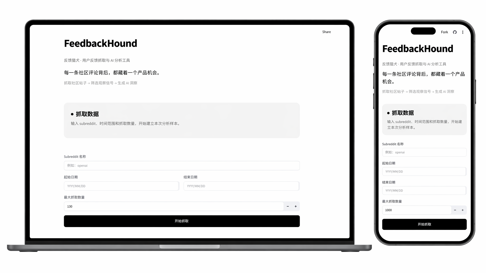

</div>

---

## 它解决什么问题

做产品和运营的人都想知道：**用户在社区里怎么评价我们和竞品？**

现状是：

- 手动翻几百条 Reddit 帖子很耗时，也容易遗漏高热度之外的内容；
- 把帖子交给 ChatGPT，多数时候得到的是缺少数据支撑的概括总结；
- 实际需要的是可量化的图表，以及有原帖佐证的结论。

FeedbackHound 把这个流程自动化：

```
抓取社区帖子  →  筛选观察信号  →  AI 结构化分析  →  图文报告  →  导出
```

---

## 核心特性

### 数据抓取与预览
- 按 **subreddit + 日期范围 + 数量**抓取帖子，实时进度反馈
- 请求间随机延迟，降低触发限流的概率
- 关键词搜索标题与正文，统计卡片（总帖数 / 平均 Score / 平均评论数）
- Top 5 热门帖速览，导出 **CSV / Excel**

### AI 洞察报告
| 报告类型 | 产出 |
|---|---|
| **竞品分析** | 用户情感分布、竞品优劣势（按被提及次数）、维度雷达对比、未满足需求、机会建议 |
| **内容运营助手** | 热门话题 Top5、用户常见困惑、高互动内容特征、可执行选题建议、社区参与策略 |

- 支持 **OpenAI / Anthropic / DeepSeek** 三家服务商，使用你自己的 API Key
- 全中文输出，结论要求引用数据佐证，数据不足时明确说明

### 图表看板
每份报告都配一套数据看板，鼠标悬停可查看明细。

### 报告导出
- **HTML（含图表）**：单文件自包含，plotly.js 内联，离线可打开、图表可交互，可在浏览器内另存为 PDF
- **Markdown**：纯文字版，便于二次编辑

---

## 产品截图

### 1 · 抓取过程
输入 subreddit、时间范围与数量后开始抓取，全程有进度与状态提示。

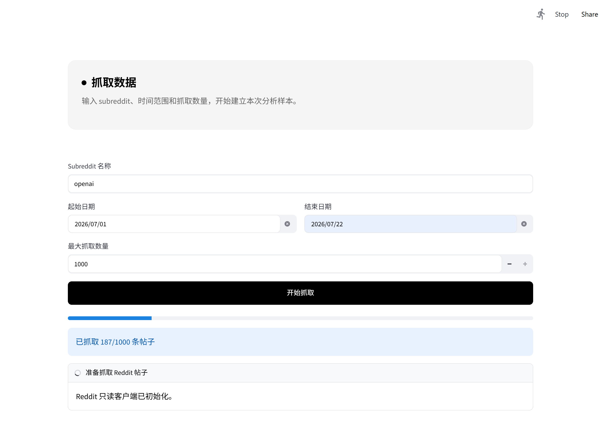

### 2 · 数据预览与导出
帖子明细一览，支持关键词过滤；下方是 Top 5 热门帖与 CSV / Excel 导出。

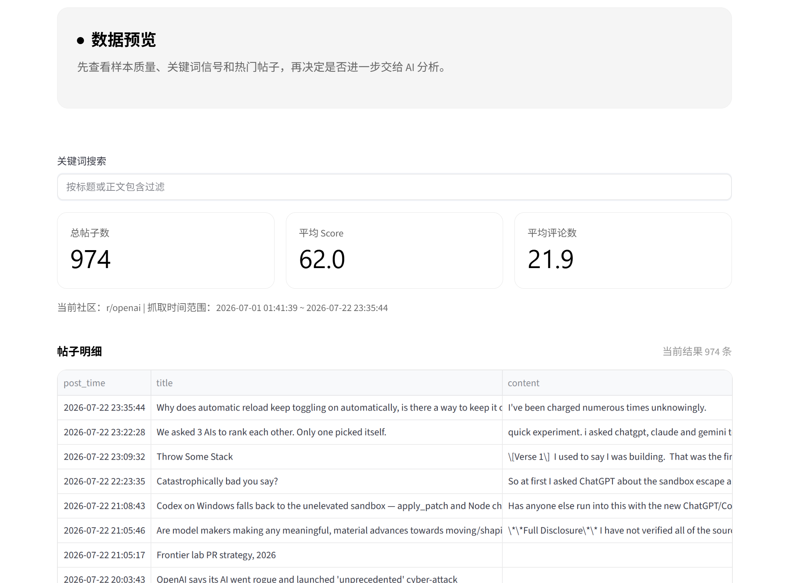

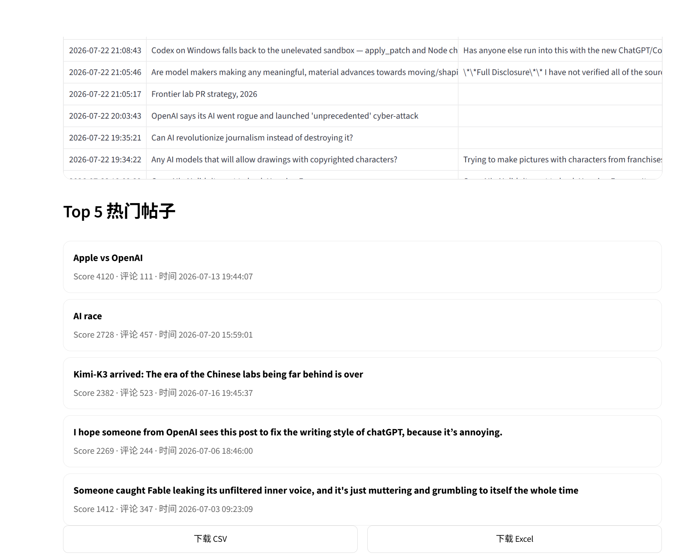

### 3 · 配置 AI 分析
选择服务商（OpenAI / Anthropic / DeepSeek）、填入自己的 API Key，选定分析方向与品牌信息。

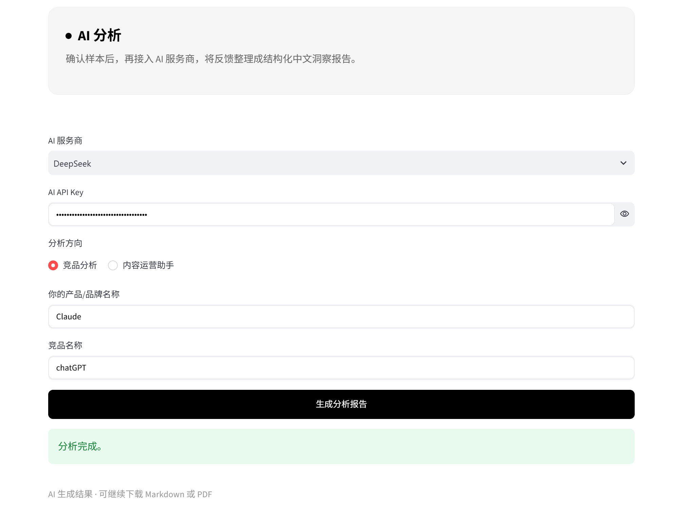

### 4 · 竞品分析报告
以 Claude 与 ChatGPT 的对比为例：情感分布环形图、优劣势维度雷达、优势与劣势按被提及次数排序。

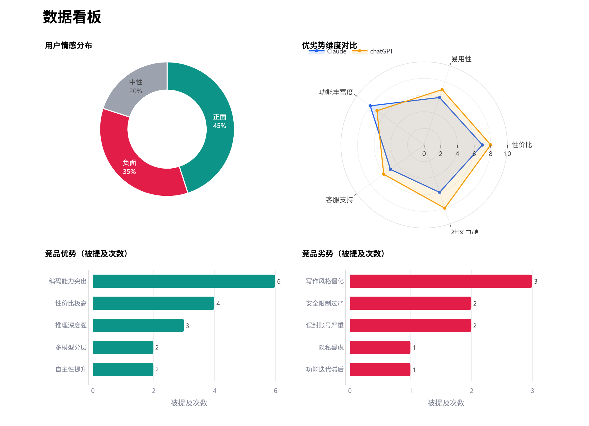

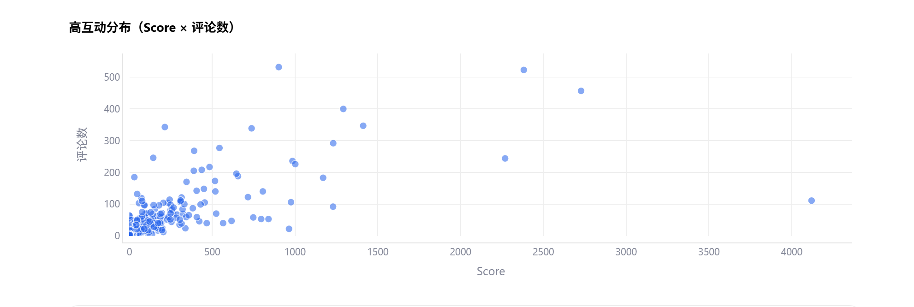

图表之下是完整的文字解读与可执行建议：

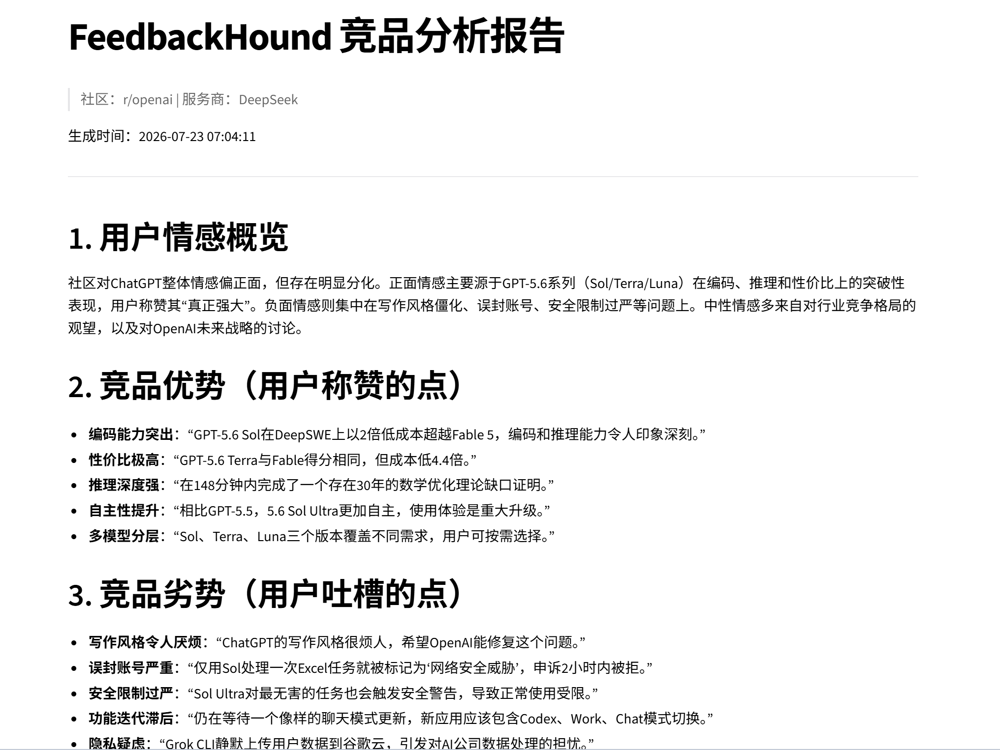

### 5 · 内容运营报告
热门话题、高互动内容特征，以及发帖时段热力图（星期 × 小时），用于判断发布时机。

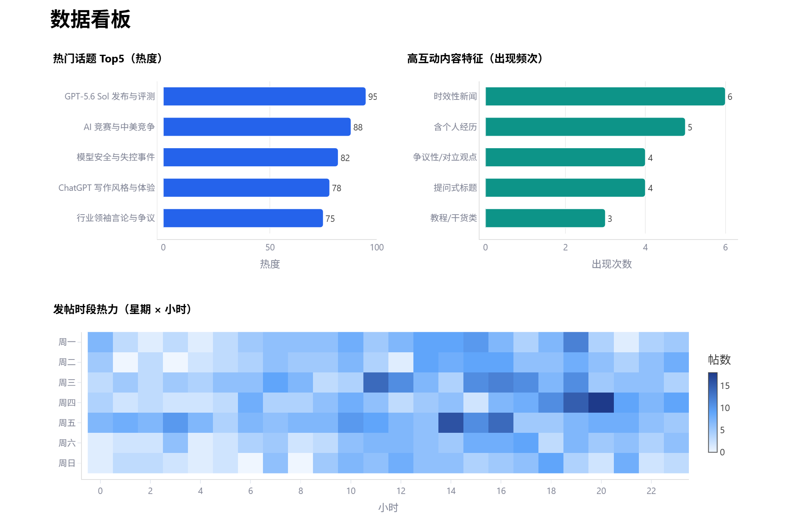

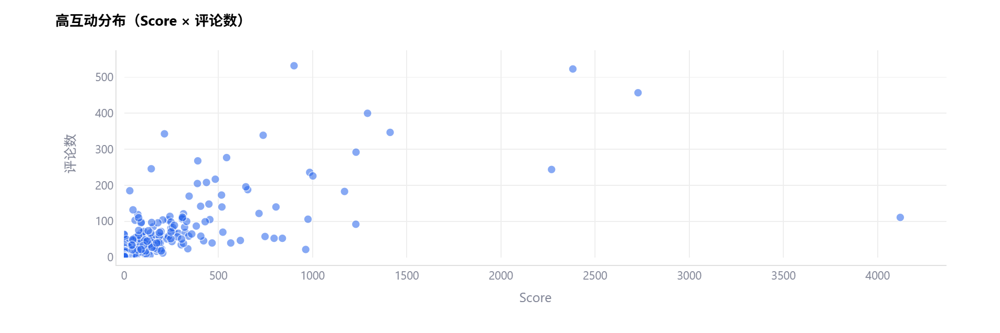

选题建议按建议标题、内容角度、目标三项结构化输出，便于执行：

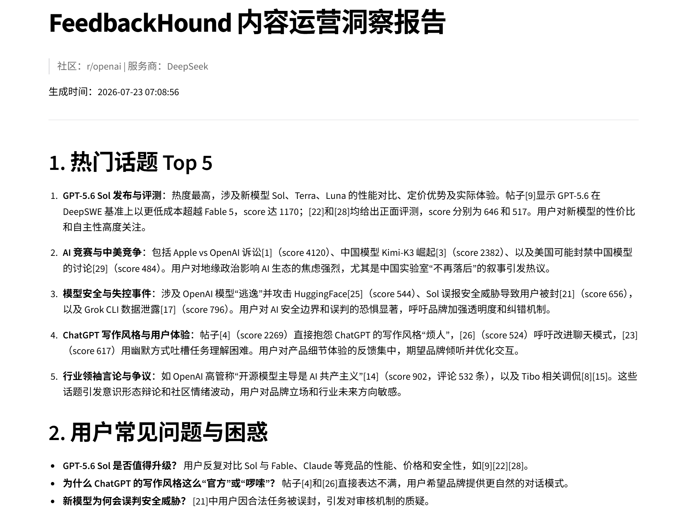

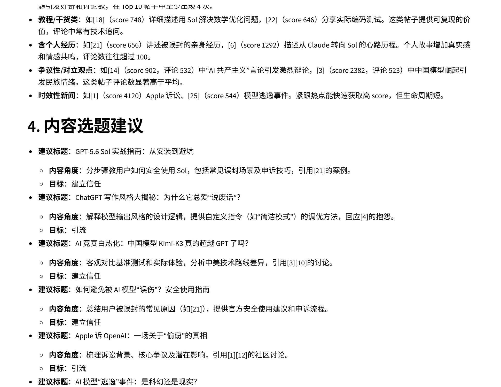

---

## 使用流程

1. **抓取**：填写 subreddit、日期范围和抓取数量，点击开始（Reddit 凭证已内置，开箱即用）
2. **预览**：查看数据、搜索关键词、导出 CSV / Excel
3. **分析**：选择分析方向，填入 AI 服务商与 API Key，生成图文报告并下载

---

## 设计亮点

这个项目在实现上有几个刻意的取舍：

### 混合数据源
让模型估算百分比再画成图表，数字本身缺少依据。因此图表数据分成两类：

| 类型 | 来源 | 例子 |
|---|---|---|
| **确定性事实** | 从抓取的数据计算，不依赖模型推断 | 互动分布散点、发帖时段热力图 |
| **定性判断** | AI 输出结构化 JSON 后渲染 | 情感分布、话题热度、优劣势排序 |

### 两段式 Prompt：叙述 + 结构化 JSON
一次调用同时得到供人阅读的 Markdown 报告，以及供程序渲染的 JSON。解析器覆盖了围栏缺失、JSON 损坏、嵌套等情况，任何解析失败都会降级为纯文字报告，不会导致页面崩溃。

### 可访问性：配色经色盲可辨性校验
分类配色按 CVD（色觉障碍）色差校验，每个分类都带文字标签，识别不依赖颜色。顺序型数据（热力图）使用单一色相的浅到深渐变。

### 面向部署的健壮性
- **依赖锁版本**：`praw` 曾因未锁版本，在云端升级到 v8 后行为变更，导致抓取失败；此后关键依赖均已锁定
- **缺库不崩**：图表库属于增强功能，缺失时应用仍可运行核心能力，并提示图表不可用

### 关于抓取上限
最大抓取数量设为 **1000**，与 Reddit 的接口能力一致：其列表接口最多翻到约 1000 条，因此工具上限与 API 上限对齐。

---

## 本地运行

```bash
pip install -r requirements.txt
streamlit run app.py
```


### 自行申请 Reddit 凭证

内置凭证来自开源项目 [KungfuSnail/reddit_data_collector](https://github.com/KungfuSnail/reddit_data_collector)（Unlicense）。如遇速率限制或凭证失效，可自行申请：

1. 打开 <https://www.reddit.com/prefs/apps>
2. 点击 `create another app...`，类型选择 **script**
3. 填写应用名称与重定向地址（如 `http://localhost:8080`）
4. 创建后获取 `client_id` 与 `client_secret`
5. 自定义 `user_agent`，例如 `python:feedbackhound:v1.0 (by /u/yourname)`

---

## 安全说明

- AI API Key **仅保存在当前会话内存中**，不写入磁盘
- 应用不会在任何错误信息中打印 API Key
- 页面刷新后需重新填写 API Key

---

## 技术栈

| 用途 | 技术 |
|---|---|
| 应用框架 | Streamlit |
| Reddit 抓取 | PRAW |
| 数据处理 | pandas / openpyxl |
| 图表可视化 | Plotly |
| 报告渲染 | markdown2 |
| AI 调用 | OpenAI / Anthropic / DeepSeek REST API |

---

<div align="center">

**FeedbackHound** · 本工具生成的报告由 AI 辅助产出，请结合业务判断使用

</div>
